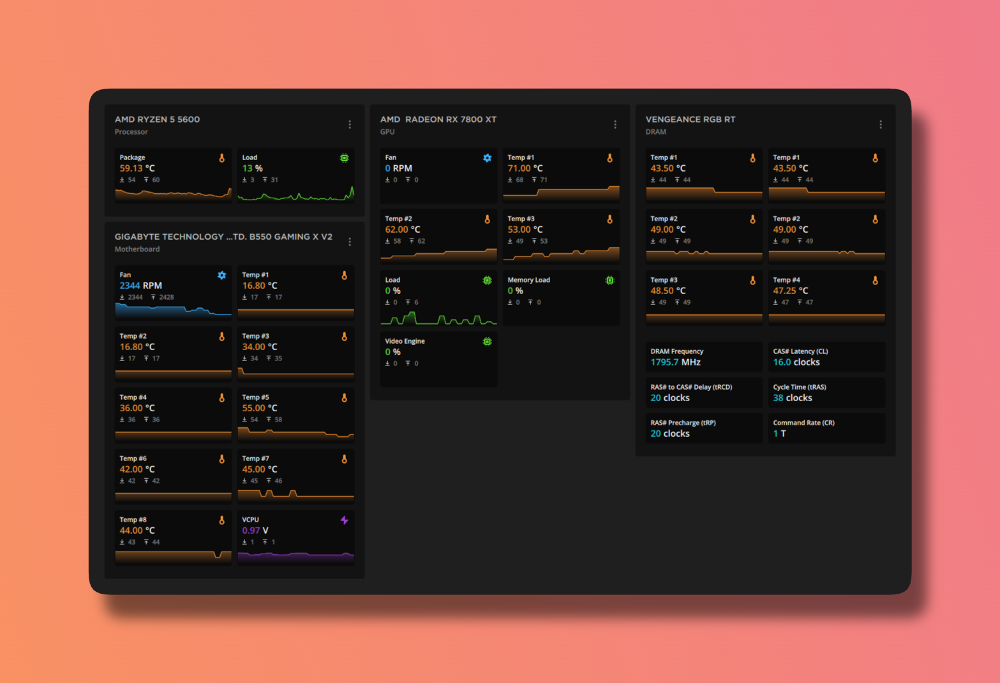
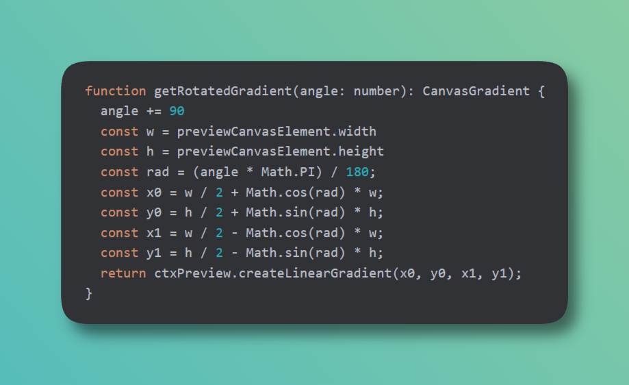
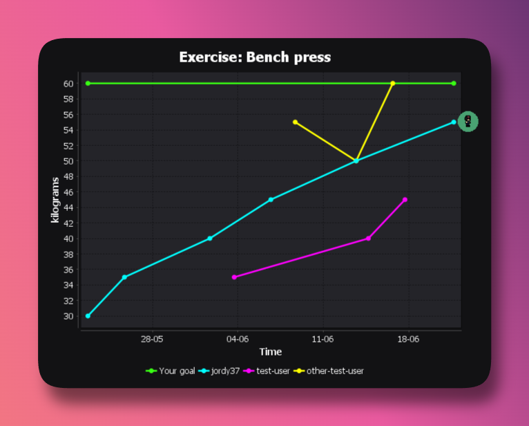
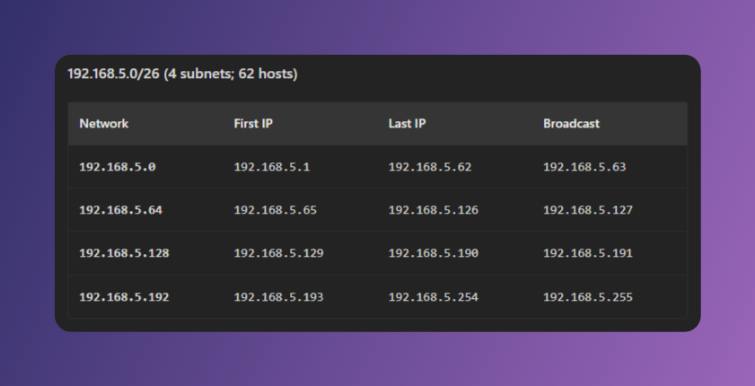

[](https://github.com/jordybronowicki37/pro-padding/releases)
[](https://github.com/jordybronowicki37)
[](https://pro-padding.onrender.com)

```text
██████╗ ██████╗  ██████╗       ██████╗  █████╗ ██████╗ ██████╗ ██╗███╗   ██╗ ██████╗ 
██╔══██╗██╔══██╗██╔═══██╗      ██╔══██╗██╔══██╗██╔══██╗██╔══██╗██║████╗  ██║██╔════╝ 
██████╔╝██████╔╝██║   ██║█████╗██████╔╝███████║██║  ██║██║  ██║██║██╔██╗ ██║██║  ███╗
██╔═══╝ ██╔══██╗██║   ██║╚════╝██╔═══╝ ██╔══██║██║  ██║██║  ██║██║██║╚██╗██║██║   ██║
██║     ██║  ██║╚██████╔╝      ██║     ██║  ██║██████╔╝██████╔╝██║██║ ╚████║╚██████╔╝
╚═╝     ╚═╝  ╚═╝ ╚═════╝       ╚═╝     ╚═╝  ╚═╝╚═════╝ ╚═════╝ ╚═╝╚═╝  ╚═══╝ ╚═════╝ 
```

## Features
- Add a professional background to your screenshot.
- Modify the size of the background around your screenshot.
- Modify the amount of spacing around your screenshot.
- Modify the size of the corner effects.
- Auto cropping of image borders.

## Upcoming features
- More backgrounds.
- Modify the shadow underneath the image.
- More options for the spacing around the image.
- Add options for adding a border.
- Add some simple draw tools.

## Examples
Here are some examples of what you can generate with this tool.

### Applications

### Code blocks

### Graphs & charts

### Data visualisations

### Social media posts

